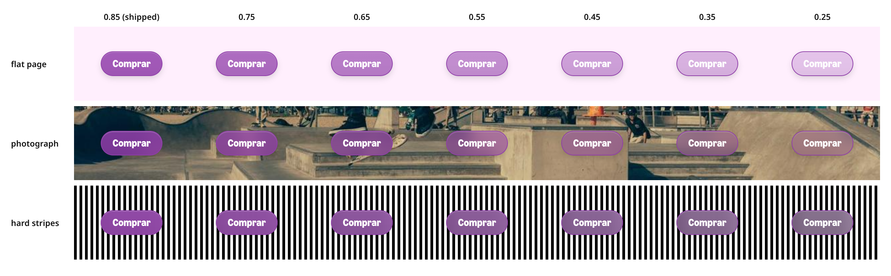

# Button

The all-purpose Bloom button. Variants for primary/secondary/inverse/icon/ghost/text actions, three sizes, loading state, optional icons on either side, and full accessibility props.

## Basic

```tsx
import { Button } from '@oxyhq/bloom';

<Button onPress={save}>Save</Button>
```

## Variants

```tsx
<Button variant="primary">Primary</Button>
<Button variant="secondary">Secondary</Button>
<Button variant="inverse">Inverse</Button>
<Button variant="ghost">Ghost</Button>
<Button variant="text">Text</Button>
<Button variant="icon" icon={<XIcon />} accessibilityLabel="Close" />
```

`primary`, `secondary`, and `inverse` get a press-scale animation; the rest don't. `icon` renders as a square hit target — pair it with `accessibilityLabel`.

## The filled variants are glass

`primary` and `destructive` are **tinted glass**: the brand colour at 85% over a `blur(10px)` of whatever is behind them, a hairline of the same colour at full strength, a lit white top rim and a soft drop shadow. The label is the fill's own on-colour, exactly as on the solid button — the pane IS the fill, so it carries the same label.

The glass is the sheen, not the wash. What reads as glass is the rim, the vertical gradient and the hairline; the 15% of the backdrop that shows through is a hint of depth, not the effect itself.

**One measured cost, stated because it is real.** The 15% bleed moves the pane toward the surface under it, which in light mode means lighter — the one direction a white label cannot afford. Of `primary`'s 180 preset × mode × surface combinations, **45 fall below WCAG AA**, in the band 4.17–4.45, all in light mode, on `blue`, `faircoin`, `green`, `mint`, `orange`, `pumpkin`, `rose`, `sky` and `yellow`. As a solid fill all 180 pass. `destructive` is unaffected (worst 5.32). The alpha at which the failures reach zero is 0.89.

If your app runs one of those nine presets in light mode and needs AA on its primary button, use `variant="inverse"` for that call site, or raise `GLASS_FILL_ALPHA`.

Over content Bloom does not own — a photograph, a video still — the pane is still 85% fill, so it behaves close to the solid button: **23 of 108** preset × mode × backdrop rows fall below AA, worst 3.61 (`destructive`: 0). If a CTA must be legible over an arbitrary image, `variant="inverse"` is opaque and backdrop-independent:

```tsx
<Button variant="inverse">Comprar</Button>
```

`secondary`, `outline`, `ghost`, `text`, `link` and `icon` are unchanged: they have no fill for the tint to replace.

### What a lower alpha would buy, and what it would cost

The recurring question about this material is whether it is transparent enough to be glass at all. `backdrop-filter` only acts on the fraction of the backdrop that gets **through** the pane, so at 0.85 the blur is running at full radius on 15% of the picture. Reproduce the whole trade with:

```bash
bun run storybook          # the DEV server; the script reads the theme through Vite
node scripts/measure-glass-alpha.mjs --url http://localhost:6006 --image docs/glass-alpha-sweep.png
```



Measured in Chrome off painted pixels, with the label removed from the measurement clones so a white glyph cannot be mistaken for backdrop:

| alpha | backdrop response | blur delta over a photo (max/mean) | blur delta on a flat page | `primary` rows < AA | `destructive` rows < AA |
| --- | --- | --- | --- | --- | --- |
| **0.85** (shipped) | 38.0 | 18 / 4.7 | 1 | 45 / 180 | 0 / 180 |
| 0.75 | 63.7 | 31 / 7.8 | 1 | 85 / 180 | 36 / 180 |
| 0.65 | 88.7 | 43 / 10.9 | 1 | 85 / 180 | 180 / 180 |
| 0.55 | 114.7 | 55 / 14.2 | 1 | 92 / 180 | 180 / 180 |
| 0.45 | 139.3 | 67 / 17.4 | 0 | 103 / 180 | 180 / 180 |
| 0.35 | 165.3 | 79 / 20.6 | 1 | 110 / 180 | 180 / 180 |
| 0.25 | 190.3 | 91 / 23.8 | 1 | 110 / 180 | 180 / 180 |

Everything is out of 255. Backdrop response is how far the painted pane moves between a white and a black backdrop — linear in `1 - alpha`, at 25.4 ± 0.7 per 0.10 of alpha. Blur delta is how much the picture changes when the blur is switched off, which is the honest form of "can you see the blur".

Three things the table settles:

- **On a flat page the blur is worth ~1/255 at every alpha, including 0.25.** There is nothing behind the pane to blur, so lowering the alpha does not make a flat page glassy — it only makes the button paler. That is the whole of the "it doesn't look glassy" complaint, and no alpha fixes it.
- **Over a photograph the blur is already visible at 0.85** (18/255 peak). Where there is something to see, the shipped material is doing the thing.
- **Legibility falls off a cliff immediately below 0.85.** One step down doubles `primary`'s AA failures and takes `destructive` from 0 to 36; two steps down puts every one of `destructive`'s 180 rows under AA.

So there is no single alpha that both matches the reference and reads as glass on a flat surface. That is a property of the material — a blur needs a backdrop — not a constant nobody has tuned yet. To make a specific surface read as glass, put something behind it.

## Sizes

```tsx
<Button size="small">Small</Button>
<Button size="medium">Medium</Button>
<Button size="large">Large</Button>
```

Heights are 32 / 36 / 44 dp; font sizes 14 / 15 / 16. The height comes from `minHeight` alone — the vertical padding is sized to keep the label's line box underneath it — so a button measures the same on native and on web, and in every variant. The one exception is `text` / `link`, which clears `minHeight` on web so the control hugs its label and sits inline.

Native adds vertical `hitSlop` to bring `small` and `medium` up to a 44 dp touch target; `large` is already there. Horizontal slop is zero, so two buttons in a row cannot steal each other's presses. On web `hitSlop` does not exist and the target is the box: 32 / 36 / 44 px.

## Loading

```tsx
const [busy, setBusy] = useState(false);

<Button
  loading={busy}
  onPress={async () => {
    setBusy(true);
    try { await submit(); } finally { setBusy(false); }
  }}
>
  Submit
</Button>
```

When `loading` is true, a centered spinner appears, children stay in the layout (hidden) so width doesn't jump, and presses are blocked. `loadingColor` overrides the spinner color (defaults to the resolved text color).

## With an icon

```tsx
<Button icon={<DownloadIcon />} iconPosition="left">Download</Button>
<Button icon={<ArrowRightIcon />} iconPosition="right">Continue</Button>
```

## Disabled

```tsx
<Button disabled>Can't click me</Button>
```

`disabled` blocks presses, drops opacity, and removes the press animation.

## Props

| Prop | Type | Default | Description |
|------|------|---------|-------------|
| `onPress?` | `() => void` | — | Press handler. |
| `children?` | `React.ReactNode` | — | Button label. Strings are auto-wrapped in `Text`. |
| `disabled?` | `boolean` | `false` | Blocks presses + drops opacity. |
| `variant?` | `'primary' \| 'secondary' \| 'inverse' \| 'icon' \| 'ghost' \| 'text'` | `'primary'` | Visual style. |
| `size?` | `'small' \| 'medium' \| 'large'` | `'medium'` | Padding + font size + min height. |
| `icon?` | `React.ReactNode` | — | Icon node rendered next to the label. |
| `iconPosition?` | `'left' \| 'right'` | `'left'` | Which side of the label. |
| `loading?` | `boolean` | `false` | Show centered spinner, block presses. |
| `loadingColor?` | `string` | text color | Override the spinner color. |
| `style?` | `StyleProp<ViewStyle>` | — | Outer container style. |
| `textStyle?` | `StyleProp<TextStyle>` | — | Label style. |
| `accessibilityLabel?` | `string` | — | Required for icon-only buttons. |
| `accessibilityHint?` | `string` | — | |
| `hitSlop?` | `{ top, bottom, left, right }` | — | Expand the touch target. |
| `testID?` | `string` | — | RN testing id. |
| `className?` | `string` | — | NativeWind class (web). |

## Recipes

### Destructive confirmation

```tsx
<Button variant="primary" style={{ backgroundColor: theme.colors.negative }} onPress={destroy}>
  Delete forever
</Button>
```

For most destructive actions, prefer a `<Dialog>` with `color: 'destructive'` actions over a destructive button in the main flow.

### Submit button with promise

```tsx
const [busy, setBusy] = useState(false);

<Button
  loading={busy}
  onPress={async () => {
    setBusy(true);
    try { await save(form); toast.success('Saved'); }
    catch (err) { toast.error(extractErrorMessage(err)); }
    finally { setBusy(false); }
  }}
>
  Save changes
</Button>
```

### Icon button row

```tsx
<View style={{ flexDirection: 'row', gap: 4 }}>
  <Button variant="icon" icon={<BoldIcon />} accessibilityLabel="Bold" />
  <Button variant="icon" icon={<ItalicIcon />} accessibilityLabel="Italic" />
  <Button variant="icon" icon={<LinkIcon />} accessibilityLabel="Link" />
</View>
```
