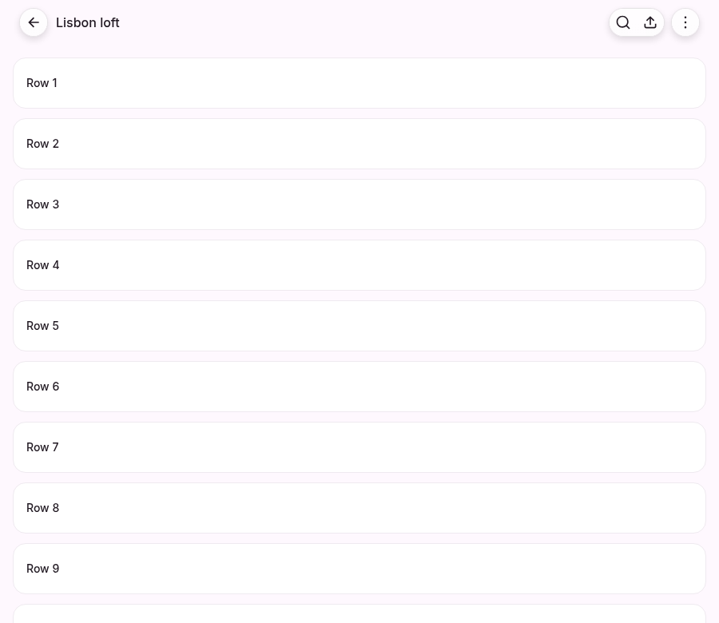
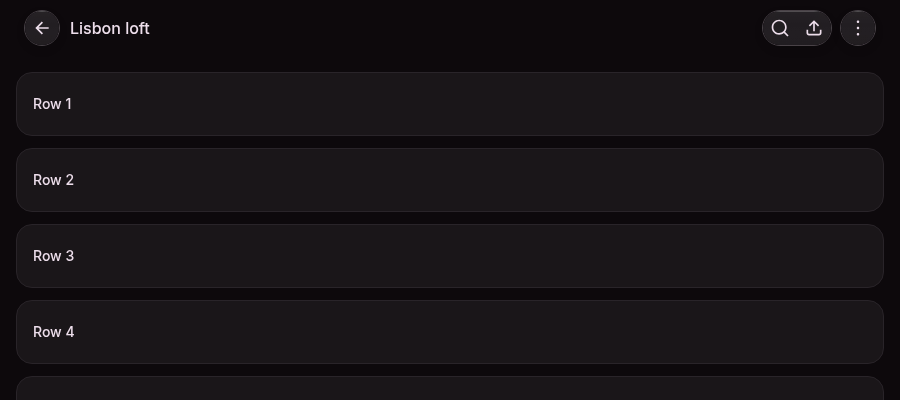
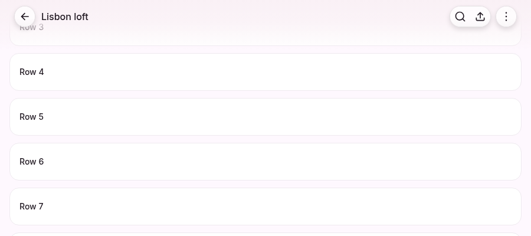
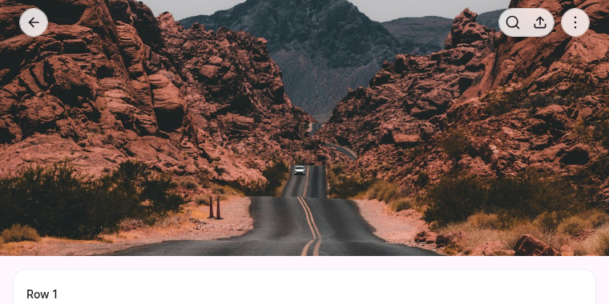

# PageHeader

```tsx
import { PageHeader } from '@oxy.so/bloom/page-header';
import { ButtonGroup, ButtonGroupItem } from '@oxy.so/bloom/button-group';

<PageHeader
  onBack={router.back}
  title="Lisbon loft"
  actions={
    <ButtonGroup accessibilityLabel="Page actions">
      <ButtonGroupItem iconOnly leadingIcon={RiSearchLine} accessibilityLabel="Search" />
      <ButtonGroupItem iconOnly leadingIcon={RiShare2Line} accessibilityLabel="Share" />
    </ButtonGroup>
  }
/>
```

Router-agnostic: the back button renders when `onBack` is set. Pass `router.back`, your app's safe-back helper, or omit it on a root screen (`router.canGoBack() ? router.back : undefined`).

## The default is floating

The header is no longer a strip. The back button sits in its own translucent capsule, the actions you declared as a group share one island, the title floats between them, and the whole thing ends in a soft vertical gradient rather than a hairline. Content passes under it.

```
  ( ← )            Lisbon loft            ( ⌕  ↗ )   ( ⋯ )

  its own island                          one island  another
```

Three things that used to be one flag are three props now:

| prop | default | |
| --- | --- | --- |
| `presentation` | `'floating'` | `'bar'` is the original opaque strip. |
| `placement` | `'inline'` | `'overlay'` floats the header over the content. |
| `scrim` / `titleReveal` | `'auto'` / `'always'` | the edge effect and the title, decided separately. |

### The islands are yours to declare

The header never infers grouping from its children's types. The `actions` slot is wrapped in a `ControlSurface` with `material: 'glass'`, so a `ButtonGroup` placed there becomes one island with no prop written on it, two `ButtonGroup`s become two islands, and a `Button` keeps its own chrome — which is what a primary action in its own accent capsule should do.

```tsx
actions={
  <>
    <ButtonGroup accessibilityLabel="Page actions">
      <ButtonGroupItem iconOnly leadingIcon={RiSearchLine} accessibilityLabel="Search" />
      <ButtonGroupItem iconOnly leadingIcon={RiShare2Line} accessibilityLabel="Share" />
    </ButtonGroup>
    <Button variant="primary" size="medium">Save</Button>
  </>
}
```

For an icon action that should sit flush on an island, use `ButtonGroupItem` — a `Button` paints its own fill and would read as a card inside the capsule. The full rule is in [Composition](/docs/composition).

### The edge effect

A vertical gradient of the page colour, fading to nothing **below** the header's own box — the ramp is 1.55× the header's height, so it finishes past the layout rather than at it. That overhang is the point: a translucent rectangle ends at its own bottom edge, and that edge is a line across the screen whether or not it is drawn.

It is an opacity ramp of one flat colour, not a blur of varying intensity. `backdrop-filter` and `expo-blur` both take a single radius for a whole surface; a real blur falloff needs the stacked layers `progressive-blur` uses, and is not what this is.

`scrim="auto"` fades it in over `[0, scrollThreshold]`, so it appears when content starts passing under. `"always"` paints it at rest — for a header born over a photograph. `"none"` removes it and leaves legibility to the islands alone.

**The colour is the PAGE's, and the header cannot read it.** The ramp's job is to fade content into the surface it is leaving, so its colour has to be that surface — `theme.colors.background` by default. A screen that paints its own background (a tinted section, a brand panel, a dark surface inside a light app) hands it over with `scrimColor`; without it the ramp is a wash of the wrong hue rather than a fade. Pass an **opaque** colour: the alpha belongs to the ramp, and a colour carrying its own would multiply with it.

**The islands protect themselves; the title does not.** An island carries its own material and is legible over both ends of the backdrop range (measured, in [Glass](/docs/glass)). A title is bare text on whatever is behind it, and with `scrim="auto"` there is nothing behind it until the page scrolls. So a header that sits over a photograph **at rest** needs one of two explicit answers:

- `titleReveal="onScroll"` — the photo already names the screen, and the title arrives with the scrim. This is what the hero pattern wants.
- `scrim="always"` — the title is the name of the screen and must be readable from the first frame, so the gradient is there from the first frame too.

Leaving both at their defaults over a hero photo is the one combination that reads as a bug, and it is a combination the header cannot resolve for you: it does not know what is behind it.

## Props

| Prop | Default | |
| --- | --- | --- |
| `title` | — | A string is the heading (`role="heading"`, `aria-level={headingLevel}`); a node renders as-is and owns its semantics. |
| `subtitle` | — | A string is a secondary line; a node renders as-is. |
| `titleAlign` | `'start'` | `'center'` centres the title on the container whatever the two sides hold. |
| `headingLevel` | `1` | |
| `titleReveal` | `'always'` | `'onScroll'` holds the title back and fades it in — for a header over a hero the photo already names. |
| `presentation` | `'floating'` | `'bar'` for the flat strip. |
| `placement` | `'inline'` | `'overlay'` positions the header over the content and claims the top edge. |
| `onBack` / `backLabel` | — / `"Back"` | `backLabel` is the button's accessible name — localise it. |
| `leading` | — | After the back capsule, before the title (an avatar, a logo). |
| `actions` | — | End of the bar. Floating: wrapped in a glass `ControlSurface`. |
| `scrim` | `'auto'` | `presentation="floating"` only. `auto` \| `always` \| `none`. |
| `scrimColor` | `theme.colors.background` | The opaque colour the edge effect fades from. Pass it when the screen paints a background the theme does not know about. |
| `border` | `'auto'` | `presentation="bar"` only. `auto` fades the separator in with scroll; `always`; `none`. |
| `transparent` | `false` | `presentation="bar"` only: background and shadow fade in with scroll. It no longer hides the title. |
| `scrollY` | — | A Reanimated `SharedValue<number>`. Omitted, the header reads `ScrollOffsetProvider`, then `window.scrollY` on web. |
| `scrollThreshold` | `20` | The offset over which the scroll-linked paint arrives. Over a hero, use the hero height minus the bar. |
| `sticky` | `true` | Web, `placement="inline"`: `position: sticky; top: 0`. No effect on native or on an overlay. |
| `safeArea` | native `true`, web `false` | Pads the top by the safe-area inset (read from `SafeAreaInsetsContext`; no provider → 0). |

## Look

- Bar min-height 56; side inset 16 below `sm`, 24 from `sm` — measured against the header's **container**, not the window, so a narrow desktop panel gets the narrow inset.
- Islands are 36 tall (a 34 control plus the hairline), 8 apart. The back capsule carries 4px of hit slop on every side, which makes it a 44pt target with nothing beside it to steal from. **A grouped item is 34 × 34 with no slop** — items in a group are adjacent, and slop on one overlaps its neighbour. Where the 44pt floor matters for every action, give each one its own island instead of grouping them.
- Island material: rung 1 of the surface ladder (the fill a card and a menu panel paint) at the chrome alpha — 0.72 light, 0.80 dark. See [Glass](/docs/glass) for what those two numbers buy and cost.
- Title `headline-medium` text-primary, subtitle `body-2-regular` secondary. Both truncate to one line.
- `bar`: background `background/full` (card; dark neutral-925), separator 1px (neutral-200; dark neutral-800), shadow `shadow-xs` once scrolled.
- No press scale. Every fade is scroll-linked, not timed, so there is no motion to reduce.
- **RTL** is structural rather than handled: the bar is a `flexDirection: 'row'`, which React Native mirrors, and the centred title's inset is the *wider* of the two sides applied to *both*, so it is symmetric by construction and has no side to get backwards.

## Placement, and who reserves the space

**`inline`** — the header is a sibling above the content in a column. It occupies layout; nothing passes under it and nothing needs padding. On web it is `position: sticky` unless you pass `sticky={false}`.

**`overlay`** — the header is absolutely positioned over the content, which starts at the top of the container and scrolls under the islands. The header then claims its measured height on the top-edge registry, and the content reads it:

```tsx
import { useTopEdgeInset } from '@oxy.so/bloom/layout';

function Screen() {
  const inset = useTopEdgeInset();
  return (
    <View style={{ flex: 1 }}>
      <ScrollView contentContainerStyle={{ paddingTop: inset }}>…</ScrollView>
      <PageHeader title="Inbox" onBack={router.back} placement="overlay" actions={…} />
    </View>
  );
}
```

`BloomProvider` already mounts `TopEdgeProvider`. The height is **measured**, not computed from a constant plus the insets — a subtitle, an enlarged font and a notch all move it, and a computed height fails silently, with content starting a few points under the islands as if that were the design.

The claim registers in an effect, so a reader mounted in the same commit sees `0` on its first render. The header narrows that to one frame by claiming its resting height (safe area + 56) immediately.

Apply the safe area **once**: the header pads itself by `insets.top` on native, and the content's padding comes from the claim, which already includes it. Do not add `insets.top` again in the scroll container.

## Scroll

Everything scroll-linked interpolates over `[0, scrollThreshold]` of the resolved offset. The header resolves it in this order:

1. the `scrollY` prop,
2. the nearest `ScrollOffsetProvider` (`@oxy.so/bloom/layout`),
3. `window.scrollY` — **web only**.

On native with none of the three, the header stays at rest.

```tsx
import { ScrollOffsetProvider } from '@oxy.so/bloom/layout';

const scrollY = useSharedValue(0);
const onScroll = useAnimatedScrollHandler(
  { onScroll: (e) => { scrollY.value = e.contentOffset.y; } },
  [scrollY],
);

<ScrollOffsetProvider value={scrollY}>
  <PageHeader title="Inbox" onBack={back} sticky={false} />
  <Animated.ScrollView onScroll={onScroll} scrollEventThrottle={16}>…</Animated.ScrollView>
</ScrollOffsetProvider>
```

The context is what makes a desktop panel work: `window.scrollY` never moves inside a fixed shell, so a header following it looked deliberately inert. Name `scrollY` in the handler's dependency array — without the worklets Babel plugin (Storybook, some web builds) a shared value missing from it never updates.

**Over media:** let the photo start under the chrome (`placement="overlay"`, or a negative margin on the hero), and set `scrollThreshold` to the hero height minus the bar so the scrim arrives as the photo leaves. Add `titleReveal="onScroll"` if the photo already names the screen.

## Accessibility

- The title is a `heading` (level 1 by default: the page header titles the page).
- The container carries no landmark role. `role="banner"` would be one banner per header, and an app shell already owns the page's banner; a page header inside `main` is not a landmark in HTML either.
- The back button is named by `backLabel`. Its island carries no `role="group"` — a group of one is a container a screen reader steps into for nothing.
- The gradient is `pointerEvents: none` and is not in the accessibility tree. The bar and the actions row are `box-none`, so the gaps between islands stay transparent to touch — a floating header covers content it does not own, and an invisible rectangle that swallowed presses across the screen would be total and silent.
- **Reduced transparency is not yet wired.** The islands are translucent on every device. Where the platform reports a reduce-transparency preference, Bloom does not currently read it; the material is legible over both ends of the backdrop range (see [Glass](/docs/glass)), but that is a legibility argument, not the preference being honoured.

## Platform notes

- **Web.** The material is `backdrop-filter` through `expo-blur`'s real web build; the gradient is `react-native-svg`. A browser without `backdrop-filter` still gets the tint and the hairline — the island keeps its geometry and its legibility, it just stops blurring.
- **iOS.** `expo-blur` provides the radius. `expo-glass-effect` is NOT used here; the tab bar is the only family on it.
- **Android.** The islands paint tint, hairline, sheen and rim with **no blur**, deliberately. `expo-blur` needs a `blurTarget` pointing at a `BlurTargetView` wrapping the content to blur, and a `BlurView` that is a descendant of the view it points at takes the process down with SIGSEGV — which is the only topology available to a surface that fills its own caller. The mechanism is in [Glass](/docs/glass); it has not changed for this header.

## What was measured, and where

Everything about a translucent surface that matters is a property of **painted pixels**, and jest sees markup. `scripts/verify-header-islands.mjs` drives a real Chrome over the Storybook stories, screenshots them, reloads the PNG into the page and samples a canvas — the round trip being the only way to read the composited result of a `backdrop-filter`, which exists nowhere in the DOM.

```bash
bun run storybook
node scripts/verify-header-islands.mjs --out docs/page-header-islands.png
```

Measured at 900 × 780, device scale 1, on the `teal` preset:

| property | how | result |
| --- | --- | --- |
| islands, not a strip | runs of chrome ≥20px along a line through the bar | **2** light (48, 126), **3** dark (36, 70, 36) |
| the island is translucent | the same back capsule over the page and over a photograph | moved **35** of 255 |
| the edge ends in nothing | the ramp against a deliberately mismatched scrim colour | travelled **67** of 255 |
| no horizontal cut | the largest single-row step down that ramp | **2** of 255 |
| a matched scrim is invisible | the same ramp with `scrimColor` = the page colour | travelled **0** |
| control | the same row sampler on `presentation="bar"` | **0** runs — a strip is one colour |

Three of those readings deserve their real explanation rather than a round number.

The ramp is measured against a **deliberately mismatched** `scrimColor`, because that is the only configuration in which its shape is visible at all: a correctly configured scrim is the page's own colour, so over the page it paints nothing and its profile is a flat line. The row below it measures exactly that — the same header, the same `scrim="always"`, the colour handed over, travelling 0.

In **light** mode the sampler reports two island runs, not three: the two action islands are 8px apart and their drop shadows meet in the gap, so at a 1-level tolerance the gap is not backdrop. The gap is visible; it is not *measurably* backdrop. In **dark** mode, where the shadow is weaker against a dark page, all three separate cleanly.

And the island fill in light mode is the card fill over a near-white page — the same relation a `Card` has to the page, read by its hairline and shadow rather than by its fill. That is deliberate, and it is why an island reads as Bloom chrome rather than as a new material.









### Android, on a device

Run on a **Pixel 8a** (Android, `akita`) through Expo Go SDK 56, against the
**published** `@oxy.so/bloom@3.0.0` from npm rather than a local build — which is
what makes it a consumer's result rather than a rehearsal of one.

| property | result |
| --- | --- |
| the edge ramp, light | rgb(231,224,231) → rgb(29,59,83), travelled **202** of 255 |
| the edge ramp, dark | rgb(18,17,22) → rgb(29,59,83), travelled **61** of 255 |
| no horizontal cut | largest single-row step **1**, monotonic, in both modes |
| the ramp is CHROMATIC | **0 achromatic rows of 311**, in both modes |
| a matched `scrimColor` | travelled **1** over its own page colour |
| the island is translucent | the back capsule reads 244 over the page, **215** over a photograph |
| the island does NOT blur | see below |

The third row is the one worth having. `react-native-svg` reads `stopColor` for
its RGB and **discards any alpha inside it**, which once painted an Android pane
as a white-to-black wipe with R=G=B on every row while every gate stayed green
(the mechanism is on `GLASS_SHEEN` in `theme/glass-colors.ts`). Counting
achromatic rows is the direct refutation, and there are none: the ramp carries
the page's hue all the way down.

**No blur, measured rather than asserted.** Over a hard 10dp stripe pattern,
sampled at the same rows inside the back capsule and on the bare stripes beside
it:

| backdrop stripe | bare | inside the island |
| --- | --- | --- |
| white | 255 | **254** |
| black | 0 | **210** |

Two things follow. The backdrop contributes **44 of 255** — about 17%, so the
pane really is translucent. And the stripe EDGE stays sharp inside the island: a
blur would smear a 26px transition, and there is none. That is tint only, which
is the documented Android behaviour, and nothing in `logcat` asked for a blur
method or reported a crash across five screens in both modes.

The native pane is slightly more opaque than the web one (≈0.83 against 0.72),
and that is `expo-blur`'s own tint, which one `intensity` drives together with
the radius and which a caller cannot decline — the difference
`GLASS_BLUR_INTENSITY` documents, showing up where it said it would.

**iOS is still not verified on a device.** The material is `expo-blur` there
too and unchanged from the `GlassSurface` the library already shipped, but
nothing in this change has been run on an iPhone.

## Not included

- **iOS large title.** A large title that collapses into the bar needs to live inside the scroll content (so it scrolls under the chrome) while the chrome lives outside it; a standalone header cannot own both without making content move at twice the scroll speed on native. `Dialog`'s own header ([Dialog](/docs/dialog)) does it because the Dialog owns its scroller.
- **Adaptive overflow.** Actions that do not fit are not collapsed into a menu. Declare fewer islands, or a menu of your own.

## Migrating to 3.0

**The default presentation changed.** A `<PageHeader>` with no `presentation` was a flat opaque bar and is now floating. Two ways forward:

- Keep the old look: add `presentation="bar"`. Everything else about that header is byte-for-byte what it was.
- Take the new one: the header is transparent, so make sure something is behind it. Either leave `placement="inline"` (the page colour shows through, which looks like the old bar minus the strip) or move to `placement="overlay"` and pad the content with `useTopEdgeInset()`.

**`transparent` no longer hides the title.** It faded the background in with scroll AND held the title back; those are `transparent` and `titleReveal="onScroll"` now. A header that wants the old combined behaviour passes both. A header that only ever wanted the fading background gets it without losing its title.

**`border` and `transparent` apply to `presentation="bar"` only.** They are ignored by the floating presentation, which has no strip and no separator; `scrim` is its counterpart.

**Icon actions want `ButtonGroupItem`.** A `Button variant="secondary"` in a floating header's actions paints its own opaque fill, which reads as a card floating over the content. It still works; it is just not the shape the islands are for.

## Migrating from app headers

Mention, Allo and Homiio each hand-roll a `Header` with an `options` object. The mapping:

| App header | `PageHeader` |
| --- | --- |
| `options.title` | `title` |
| `options.titlePosition: 'left' \| 'center'` | `titleAlign: 'start' \| 'center'` |
| `options.subtitle` (string or node) | `subtitle` |
| `options.showBackButton` (+ `useSafeBack` / `router.back` inside) | `onBack={safeBack}` — omit to hide |
| Homiio `showBackButton && router.canGoBack()` | `onBack={router.canGoBack() ? router.back : undefined}` |
| `options.leftComponents: ReactNode[]` | `leading={<>…</>}` |
| `options.rightComponents: ReactNode[]` | `actions={<>…</>}`, grouped into `ButtonGroup`s |
| `hideBottomBorder` | `presentation="bar"` + `border="none"` |
| `disableSticky` | `sticky={false}` |
| web `window.scrollY > 20` sticky state | built in (`scrollThreshold`, default 20) |
| Homiio `options.transparent` / `options.scrollThreshold` | `presentation="bar" transparent titleReveal="onScroll"` / `scrollThreshold` |
| Homiio `scrollY` | `scrollY`, or a `ScrollOffsetProvider` around the screen |
| Homiio `useSafeAreaInsets().top` | `safeArea` (default on native) |
| Mention `options.headerTitleStyle` | pass a node `title` |
